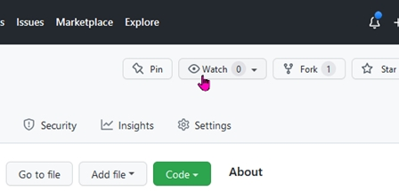

# MidEast Coast

## Scenario

MidEast Coast goes back in time a couple of decades from the original MEP, so we are firmly in the 1950’s Steam Era. As such this was the time when coal was a major part of the UK economy, not only to keep industry and the railways going but there was a massive increase in electricity demand after recovery from the Second World War. New power stations were being built, especially in the Midlands and Yorkshire. Several of these are included with extensive additions of the North Midlands and Yorkshire Coal Mines.

The route is not completely prototypical as there are some facilities that never existed and some have been resurrected from Dr Beeching’s cuts. In particular some of the lost lines of Lincolnshire and Norfolk have been brought back to life enabling more direct excursions to Skegness and Hunstanton.

A short extension to the original MEP layout has been added from Firsby to Spilsby. Further Lost lines will be added in future.

## Compatibility

This content is compatible with Open Rails v1.4 (and not with MSTS). The content is stand-alone and only needs an Open Rails installation.

## Installing

1. **Highly Recommended**: Follow [these instructions](https://www.dropbox.com/s/5p2jbgdtdpa380a/Using%20routes%20published%20on%20GitHub%20v1.pdf?dl=0) to benefit from using Git.

2. Register for a free account at GitHub.com to enable the "Watch" feature.

3. Click the Watch button to be emailed whenever updates are made.

or

1. Quick: [Download the ZIP](https://github.com/MECoast/MECoast/archive/refs/heads/main.zip) and unpack it.

## Legal

MidEast Coast is the copyright of Mick Clarke.

This work is covered by the Creative Commons 4.0 International - CC-BY-NC-ND

Licence details are to be found at [About CC Licenses - Creative Commons](https://creativecommons.org/about/cclicenses/)
